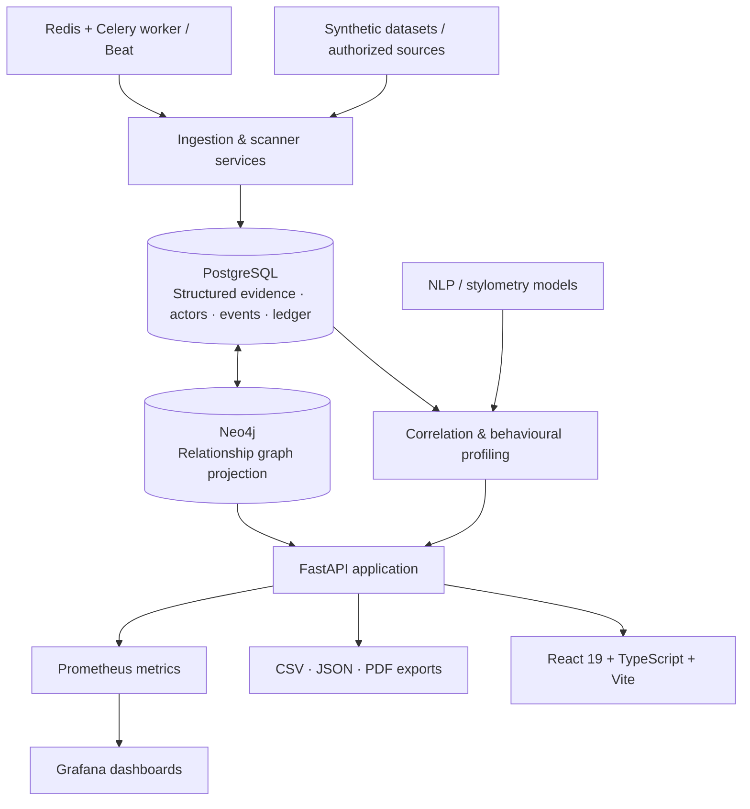

# DeCypher
### Evidence-led threat intelligence, actor correlation & investigation platform

<p align="center">
  <strong>Smart India Hackathon 2026 · Problem Statement 26151 · NTRO</strong>
</p>

<p align="center">
  
  
  
  
  
  
  
  
</p>

**DeCypher** is an investigator-facing threat-intelligence platform for organizing evidence, exploring relationships between digital personas, and prioritizing actor investigations in a controlled demonstration environment.

It brings structured evidence, graph relationships, stylometric signals, temporal records, behavioural profiles, and investigator feedback into one workflow. Rather than treating a single indicator as decisive, DeCypher presents explainable signals and their provenance so an investigator can review how a correlation was formed.

> **Responsible-use boundary:** The bundled data is synthetic and the scanner is designed for explicitly authorized infrastructure. Correlation, confidence, anomaly, and priority values are investigative decision-support signals—not proof of identity, intent, or wrongdoing.

---

## Contents

- [Why DeCypher](#why-decypher)
- [Platform capabilities](#platform-capabilities)
- [System architecture](#system-architecture)
- [Correlation and scoring](#correlation-and-scoring)
- [Behavioural profiling](#behavioural-profiling)
- [Evidence integrity](#evidence-integrity)
- [Technology stack](#technology-stack)
- [Repository structure](#repository-structure)
- [Getting started](#getting-started)
- [API overview](#api-overview)
- [Synthetic dataset](#synthetic-dataset)
- [Security and responsible use](#security-and-responsible-use)
- [Testing and quality checks](#testing-and-quality-checks)
- [Documentation](#documentation)
- [Known limitations](#known-limitations)
- [Contributing](#contributing)
- [License](#license)

---

## Why DeCypher

Threat investigations can involve fragmented identifiers and evidence spread across handles, wallets, PGP keys, marketplaces, infrastructure observations, and time-stamped events. Reviewing each signal in isolation makes it difficult to understand how records relate—or why a system has suggested a connection.

DeCypher provides a common investigation workspace that:

- brings heterogeneous evidence into a structured actor-centric model;
- connects related entities in an explorable graph;
- combines independent indicators through a transparent correlation service;
- exposes the evidence and sensitivity behind a score;
- records investigator feedback and evidence history;
- provides exports that can accompany an investigation.

The platform is designed to assist human review. It does not autonomously declare that two online identities belong to the same real-world person.

---

## Platform capabilities

### Actor intelligence and investigation

- Actor directory with risk category, confidence, operational priority, and activity metadata.
- Search across actor identifiers, handles, wallet addresses, and PGP fingerprints.
- Actor detail views containing associated handles, wallets, marketplaces, PGP keys, trust relationships, and evidence.
- Evidence timelines and actor-specific investigation context.
- Investigator feedback with recorded verdicts and notes.

### Relationship graph

- Neo4j-backed graph projection for actors and related evidence entities.
- Graph relationships across handles, wallets, marketplaces, PGP keys, trust links, observations, and infrastructure.
- Interactive force-directed graph exploration in the frontend.
- PostgreSQL-backed graph fallback for actor graph queries when Neo4j is unavailable.

### Evidence correlation and explainability

The correlation service evaluates available evidence signals, including:

- wallet reuse;
- infrastructure reuse;
- TLS/certificate reuse;
- service/banner matches;
- descriptor-timing similarity;
- stylometric similarity.

The service returns signal-level evidence and an overall correlation result. It also supports leave-one-signal-out counterfactual analysis, allowing an investigator to see how the score changes when an available signal is removed.

Operational priority is calculated separately from identity confidence. It is a triage aid, not an identity probability.

### Stylometry and NLP

- Bundled authorship-model artifacts and feature extraction for comparing text samples.
- Domain-aware authorship comparison using the project's PAN20 and DeCypher model artifacts.
- Linguistic markers and similarity outputs exposed through the NLP API.
- Stylometric similarity used as one input to broader evidence correlation—not as standalone attribution.

### Behavioural profiling

Actor behavioural profiles aggregate evidence already recorded by the platform across five dimensions:

- **Linguistic:** post-level style features and per-handle / actor-level aggregation.
- **Lifecycle:** registration and observed activity windows, account status, overlap, and gaps.
- **Operational:** marketplace footprint, wallet associations, and PGP-key associations.
- **Interaction:** incoming/outgoing trust relationships, counterparties, and recorded edge confidence.
- **Infrastructure:** provenance-tagged infrastructure observations.

Profiles are versioned and fingerprinted. Refreshing an unchanged source set is idempotent, and the service can compare snapshots to describe changes over time.

### Temporal and graph analytics

- Normalized temporal events materialized from timestamps present in the evidence store.
- Actor timelines with event types, sources, and time filters.
- Population-relative graph anomaly features covering wallet/PGP reuse, trust relationships, infrastructure reuse, marketplace switching, lifecycle overlap, temporal density, and source diversity.
- Methodology and contributing features returned with analytics results.

These outputs support triage and review; they are not causal explanations or identity verdicts.

### Evidence integrity

- Append-only SHA-256 hash chain for structured observation evidence.
- PostgreSQL advisory locking to serialize ledger appends.
- Observation persistence and ledger writes performed within the same transaction.
- Chain verification and integrity-status endpoints.
- Merkle-rooted evidence blocks with chained block hashes.

**Important distinction:** The bundled implementation provides an internal tamper-evident ledger. It does not ship a public blockchain transaction signer or automatically anchor records to an external blockchain. External anchoring is an optional deployment integration boundary.

### Collection and authorized scanning

- Controlled infrastructure scanner with bounded responses and configured host allowlists.
- Optional scheduled scanning through Celery Beat, Redis, and Celery workers.
- Registered collection sources supporting JSON, RSS, HTML, and configured Tor HTTP collection.
- Tor inspection and descriptor parsing paths for explicitly allowlisted, authorized sources. Descriptor parsing can process supplied descriptor text; live hidden-service inspection requires a configured SOCKS5 Tor proxy and an explicitly allowlisted onion host.
- Scan and collection runs create structured observations that can feed graph projection and correlation.

Autonomous scanning and continuous collection are disabled by default. The default scanner/collection allowlists are loopback-oriented, and no live collection source or public onion target is bundled. Configure only sources and targets you are authorized to access, and do not broaden allowlists without an explicit authorization and safety review.

### Advanced intelligence

The advanced intelligence API and investigator interface also include:

- source-reliability estimates conditioned on investigator feedback from other actors;
- evidence ablation and stylometry discovery workflows;
- calibration evaluation against the bundled synthetic labels;
- historical-case evaluation harness;
- media fingerprinting using SHA-256 and perceptual dHash comparison;
- technical entity linkage;
- persisted alerts delivered to the UI over an authenticated WebSocket.

### Investigator workspace

The React application includes:

- investigation dashboard and priority queue;
- global search;
- actor profile and evidence views;
- relationship graph;
- advanced intelligence workspace;
- dark/light theme preference;
- notifications and live alert updates;
- bulk and actor-level CSV, JSON, and PDF exports.

The optional DeCypher Copilot uses Gemini from the backend. The Gemini key is never required by the core platform and must never be placed in frontend configuration.

---

## System architecture



### Data flow

1. Synthetic datasets or explicitly authorized sources provide actor and observation records.
2. The ingestion layer normalizes evidence and persists structured records in PostgreSQL.
3. Evidence relationships are projected into Neo4j for graph exploration; PostgreSQL remains the structured evidence store.
4. Correlation and profiling services calculate explainable, evidence-derived outputs.
5. FastAPI exposes authenticated investigation, analytics, integrity, and export endpoints.
6. The React frontend requests data from the API and presents it for investigator review.
7. Observation writes are accompanied by evidence-ledger entries; temporal events are materialized from known timestamps.
8. Optional workers schedule authorized scans and collection jobs through Redis.

---

## Correlation and scoring

DeCypher separates **evidence correlation** from **operational prioritization**.

- Correlation combines the available evidence signals using the configured weighted model.
- Counterfactual analysis removes one available signal at a time and recomputes the score to expose sensitivity to that signal.
- Source-reliability estimates use investigator feedback from other actors, with conservative priors and bounded multipliers.
- Operational priority combines evidence and risk-related factors to help order an investigation queue.
- Investigator feedback is recorded and incorporated through the documented adjustment logic.

A high score means that the configured evidence model found stronger support within the available records. It does not mean that identity has been established. See [Correlation Analysis](docs/correlation-analysis.md) for methodology and interpretation.

---

## Behavioural profiling

A behavioural profile is a descriptive aggregation of recorded evidence, not a prediction of future behaviour.

The current profile implementation uses existing actor, handle, wallet, PGP, trust-link, observation, and post records. It stores a profile version, source fingerprint, coverage score, generation timestamp, and structured profile data. Snapshot comparisons describe changes in measured features and evidence dimensions.

**Current data limitation:** the bundled `posts.csv` profiling path does not provide usable per-post event timestamps. Posting-hour, weekday-routine, and posting-cadence analytics are therefore not available from that dataset. Coverage measures available data dimensions; it is not a confidence score or identity probability.

See [Behavioural Profiling](docs/behavioral-profiling.md).

---

## Evidence integrity

The evidence ledger is an internal, append-only SHA-256 chain stored in PostgreSQL. Each record commits to its canonical evidence payload and the preceding record hash. Verification recomputes the chain to identify broken links or changed records.

Merkle-style blocks can be sealed over ledger entries and verified independently within the application.

The ledger can help detect changes to records already committed to it. It cannot establish that an original observation was truthful, independently sourced, or correctly attributed. External blockchain anchoring is not active in the bundled setup.

See [Evidence Integrity](docs/evidence-integrity.md) and [Advanced Intelligence](docs/advanced-intelligence.md).

---

## Technology stack

| Layer | Technologies |
|---|---|
| Frontend | React 19, TypeScript, Vite, React Router, Lucide React |
| Graph visualization | `react-force-graph-2d` |
| API | Python 3.11+, FastAPI, Uvicorn, Pydantic |
| Persistence | PostgreSQL, SQLAlchemy |
| Relationship graph | Neo4j 5 |
| Background processing | Celery, Redis |
| Authentication | OAuth2 password flow, JWT, bcrypt, role checks |
| NLP / ML | scikit-learn, SciPy, pandas, NumPy, joblib |
| AI assistant (optional) | Gemini API, called server-side |
| Reports | ReportLab (PDF), CSV, JSON |
| Observability | Prometheus, Grafana |
| Infrastructure | Docker, Docker Compose |
| Testing | pytest, HTTPX, Oxlint, TypeScript, Vite build |

---

## Repository structure

```text
DeCypher/
├── ai/
│   └── nlp/
│       ├── compare_handles.py
│       └── models/                 # Bundled authorship model artifacts
├── backend/
│   ├── app/
│   │   ├── database/               # PostgreSQL and Neo4j clients
│   │   ├── middleware/             # Audit logging
│   │   ├── models/                 # SQLAlchemy and API schemas
│   │   ├── routers/                # Auth, actors, search, analytics, exports...
│   │   ├── services/               # Ingestion, correlation, graph, NLP, integrity...
│   │   └── workers/                # Celery application and tasks
│   ├── scripts/
│   ├── tests/
│   ├── Dockerfile
│   ├── docker-compose.yml
│   ├── .env.example
│   └── requirements.txt
├── data/                           # Synthetic CSV and JSON evidence
├── docs/                           # Architecture and feature methodology
├── frontend/
│   ├── src/
│   │   ├── api/                    # Typed API client
│   │   ├── components/             # Copilot, exports, notifications
│   │   └── pages/                  # Dashboard, search, actor, graph, advanced
│   ├── package.json
│   └── package-lock.json
├── infra/                          # Authorized scanner and monitoring config
├── mock_service/                   # Controlled local demo service
├── submission/                     # SIH submission material
├── CONTRIBUTING.md
├── SECURITY.md
└── README.md
```

---

## Getting started

### Fastest path: local SIH demo

You do not need to create or edit `backend/.env` manually for the normal local demonstration.

#### Windows PowerShell

Prerequisites:

- Git
- Docker Desktop with Docker Compose
- Node.js **20.19+** or **22.12+**
- npm

Clone and start:

```powershell
git clone https://github.com/ParveshTanwarr/DeCypher.git
cd DeCypher
powershell -ExecutionPolicy Bypass -File .\scripts\start_demo.ps1
```

The bootstrap creates or repairs only known template placeholders in `backend/.env`, generates local secrets, keeps autonomous scanning and continuous collection disabled, starts the Docker stack, waits for the dependency-aware API health check, installs frontend dependencies when needed, and starts Vite.

#### Linux / macOS

Prerequisites:

- Git
- Docker Engine or Docker Desktop with Docker Compose
- Node.js **20.19+** or **22.12+**
- npm
- `curl`

Clone and start:

```bash
git clone https://github.com/ParveshTanwarr/DeCypher.git
cd DeCypher
bash ./scripts/start_demo.sh
```

The shell bootstrap provides the same local-demo behavior. It does not require Python on the host.

When startup completes, open:

- Frontend: http://localhost:5173
- API: http://127.0.0.1:8000
- API docs: http://127.0.0.1:8000/docs

The bootstrap prints the generated local application credentials:

```text
admin   : <generated password>
analyst : <generated password>
```

The generated `backend/.env` is local-only and is ignored by Git. Database passwords, the JWT secret, and Grafana credentials are not printed by the bootstrap.

### What the demo bootstrap checks

The bootstrap fails early with a direct message when:

- Docker is missing or its engine is not running;
- Docker Compose is unavailable;
- Node.js/npm are missing or the Node.js version is too old;
- the repository is incomplete;
- required environment credentials cannot be established;
- Docker Compose fails to start the stack;
- the dependency-aware API health check does not become healthy within five minutes;
- frontend dependency installation fails.

It uses the existing `/health/live` endpoint only for container liveness; the final bootstrap readiness gate uses `/health` so PostgreSQL, Neo4j, Redis, and the validated NLP engine must be healthy.

### Demo reproducibility

The bundled SIH demonstration uses a frozen reference date of **2026-10-05** and dataset version `2026-10-05-v1`.

In demo mode, correlation recency is calculated against that fixed reference date rather than the machine's wall clock. This keeps the same bundled historical evidence from changing priority scores simply because the demo is opened on a different machine or at a different time.

The repository also validates the bundled historical date fields before demo startup. Future-dated source records cause startup to fail rather than being silently clamped at display time.

### Existing local databases

The normal bootstrap does **not** delete Docker volumes or existing PostgreSQL/Neo4j state.

If a machine contains stale demo volumes from an older DeCypher checkout and the goal is to recreate the clean bundled demonstration state, use the explicit destructive reset:

Windows:

```powershell
powershell -ExecutionPolicy Bypass -File .\scripts\reset_demo.ps1
```

Linux/macOS:

```bash
bash ./scripts/reset_demo.sh
```

The reset command removes local PostgreSQL, Neo4j, Prometheus, and Grafana Docker volumes. Do not use it when local investigation data must be preserved.

### Manual developer setup

The traditional manual setup remains available when you need host-side API development or custom configuration.

Copy the template:

```text
backend/.env.example → backend/.env
```

The Docker Compose configuration uses these environment values for local container credentials and overrides service-to-service URLs inside the Compose network.

At minimum, configure:

| Variable | Purpose |
|---|---|
| `POSTGRES_PASSWORD` | PostgreSQL container password |
| `DATABASE_URL` | Host-side database URL; its password should match `POSTGRES_PASSWORD` |
| `NEO4J_PASSWORD` | Neo4j authentication password |
| `SECRET_KEY` | Unique JWT signing secret |
| `ADMIN_PASSWORD` | Local `admin` application account |
| `ANALYST_PASSWORD` | Local `analyst` application account |
| `SCANNER_SERVICE_PASSWORD` | Local scanner service account |
| `GRAFANA_ADMIN_PASSWORD` | Grafana administrator password |

Do not commit `backend/.env`. The repository intentionally does not publish universal working credentials.

### Host Uvicorn development

Use host Uvicorn only when you intentionally want the API process outside Docker. Do not run host Uvicorn alongside the Compose `api` service on port 8000.

Start dependencies from `backend/`:

```bash
docker compose up -d postgres neo4j redis
python3.11 -m venv .venv
source .venv/bin/activate
python -m pip install -r requirements.txt
python -m uvicorn app.main:app --reload --host 127.0.0.1 --port 8000
```

On Windows PowerShell:

```powershell
docker compose up -d postgres neo4j redis
py -3.11 -m venv .venv
.\.venv\Scripts\Activate.ps1
python -m pip install -r requirements.txt
python -m uvicorn app.main:app --reload --host 127.0.0.1 --port 8000
```

### Stopping the stack

From `backend/`:

```bash
docker compose down
```

This stops containers while retaining named data volumes.

Avoid `docker compose down -v` unless you deliberately intend to delete local database and monitoring state.

## API overview

Interactive, version-specific request and response schemas are available at `/docs` when the API is running. The following is a functional overview; role requirements are enforced per route.

| Area | Representative endpoints |
|---|---|
| Health and authentication | `GET /health`, `POST /auth/token` |
| Actors | `GET /actors`, `GET /actors/{actor_id}` |
| Search | `GET /search?q=...` |
| Evidence and graph | `GET /actors/{actor_id}/evidence`, `GET /actors/{actor_id}/graph` |
| Behavioural profiles | `GET /actors/{actor_id}/behavioral-profile`, `POST /actors/{actor_id}/behavioral-profile/refresh` |
| Correlation | `GET /correlation/actor/{actor_id}`, `GET /correlation/actor/{actor_id}/counterfactual` |
| Investigator feedback | `GET/POST /investigator/feedback` |
| NLP | `POST /nlp/compare` |
| AI Copilot | `POST /ai/chat` (optional Gemini configuration) |
| Evidence integrity | `GET /integrity/status`, `GET /integrity/verify`, `GET /integrity/ledger` |
| Temporal analytics | `GET /analytics/actors/{actor_id}/timeline` |
| Graph anomalies | `GET /analytics/actors/{actor_id}/graph-anomaly`, `GET /analytics/graph-anomalies` |
| Exports | `GET /export/csv`, `GET /export/json`, `GET /export/report` |
| Actor exports | `GET /export/actor/{actor_id}/csv`, `GET /export/actor/{actor_id}/json`, `GET/POST /export/actor/{actor_id}/report` |
| Authorized scanning | `/scanner/targets`, `/scanner/jobs`, `/scanner/observations` |
| Collection | `/collection/sources`, `/collection/runs`, `/collection/status` |
| Tor intelligence | `POST /tor/inspect`, `POST /tor/descriptor/parse` |
| Advanced evidence | `/correlation/stylometry-discovery`, `/correlation/actor/{actor_id}/ablation`, `/media/fingerprint`, `/media/compare` |
| Merkle integrity | `GET /integrity/merkle-status`, `GET /integrity/merkle-verify`, `POST /integrity/merkle-seal` |
| Live alerts | `/alerts/ws` (WebSocket; token sent as the first message) |
| Metrics | `GET /metrics` |

Protected routes require a bearer token. The login endpoint accepts OAuth2 form data (`application/x-www-form-urlencoded`), not a JSON body. Consult Swagger for exact schemas, parameters, and role requirements before invoking state-changing endpoints.

---

## Synthetic dataset

The repository's bundled dataset is generated for controlled development and demonstrations. It is not a scrape of real people, real dark-web content, or real infrastructure.

The documented source tables include:

| File | Documented contents |
|---|---|
| `actors.csv` | 600 synthetic actor ground-truth records |
| `handles.csv` | 896 synthetic persona/handle records |
| `posts.csv` | 115,000 synthetic marketplace-style text posts |
| `wallets.csv` | 1,043 synthetic wallet records |
| `infrastructure_indicators.csv` | 250 synthetic infrastructure indicators |
| `marketplaces.csv` | Marketplace reference data |
| `trust_links.csv` | Synthetic PGP-backed trust/signature relationships |

The ground-truth actor labels are included to support controlled evaluation. They must not be used as model input when evaluating whether the system can recover relationships. See [Dataset documentation](data/README.md) for the schema and intended use of each file.

---

## Security and responsible use

DeCypher is a controlled defensive and academic demonstration platform.

- Use only datasets you are permitted to process.
- Scan only infrastructure you own or have explicit authorization to assess.
- Keep scanner and collection allowlists narrow.
- Autonomous scanning and continuous collection are disabled by default.
- Do not use the platform to bypass access controls, collect credentials, or target uninvolved third parties.
- Keep JWT secrets, application passwords, database credentials, API keys, and private material out of source control.
- Treat correlation, stylometry, graph anomaly, source-reliability, and priority outputs as reviewable leads—not proof.
- Preserve source provenance and document the limitations of any evidence used in an investigation.

See [SECURITY.md](SECURITY.md) for the security policy and [backend/NEO4J_RECOVERY.md](backend/NEO4J_RECOVERY.md) / [backend/POSTGRES_RECOVERY.md](backend/POSTGRES_RECOVERY.md) for local database recovery guidance.

---

## Testing and quality checks

### Backend

From `backend/` with the project environment active:

```bash
pytest -q
```

### Frontend

From `frontend/`:

```bash
npm ci
npm run lint
npm run build
```

### Infrastructure scanner

From `infra/`:

```bash
python -m pip install requests pytest
pytest -q tests
```

The GitHub Actions workflow runs backend tests against PostgreSQL, frontend lint/build checks, infrastructure tests, and a Docker image build on pushes and pull requests targeting `main`. A configured workflow is not a guarantee that every local or external integration is available; inspect the run results for the commit you intend to use.

---

## Documentation

- [System Architecture](docs/architecture.md)
- [Behavioural Profiling](docs/behavioral-profiling.md)
- [Correlation Analysis](docs/correlation-analysis.md)
- [Evidence Integrity Ledger](docs/evidence-integrity.md)
- [Temporal Analytics](docs/temporal-analytics.md)
- [Graph Anomaly Analysis](docs/graph-anomaly-analysis.md)
- [Autonomous Scanning](docs/autonomous-scanning.md)
- [Advanced Intelligence](docs/advanced-intelligence.md)
- [PostgreSQL Recovery](backend/POSTGRES_RECOVERY.md)
- [Neo4j Recovery](backend/NEO4J_RECOVERY.md)
- [Contributing Guide](CONTRIBUTING.md)
- [Security Policy](SECURITY.md)

---

## Known limitations

- The included evidence is synthetic. It does not establish real-world attribution performance.
- Behavioural posting-hour, weekday, and cadence analysis is unavailable where source posts lack usable event timestamps.
- Stylometric comparison is dependent on text quantity, language/domain, model coverage, and the quality of source material.
- Source-reliability estimates are conditioned on available investigator feedback; they are not independent ground truth.
- Graph anomaly values are population-relative triage features, not causal explanations.
- Internal hash-chain/Merkle verification does not prove the truth of source observations.
- External public-blockchain anchoring is not implemented as an active transaction workflow in the bundled project.
- Gemini Copilot requires a separately configured backend API key.
- Autonomous scanning, continuous collection, and live Tor inspection require deliberate configuration and authorized targets. Live Tor inspection additionally requires a working `TOR_SOCKS5_PROXY` and an allowlisted onion host; descriptor parsing alone does not perform network collection.
- The repository does not include live dark-web collection credentials, a preconfigured Tor proxy, or real-world attribution validation infrastructure.

---

## Contributing

Contributions are welcome. Please read [CONTRIBUTING.md](CONTRIBUTING.md) before opening a pull request.

For changes to correlation, profiling, authentication, scanner policy, persistence, or exports, include regression tests and document any changes to interpretation or safety boundaries.

## License

This project is distributed under the [MIT License](LICENSE).
